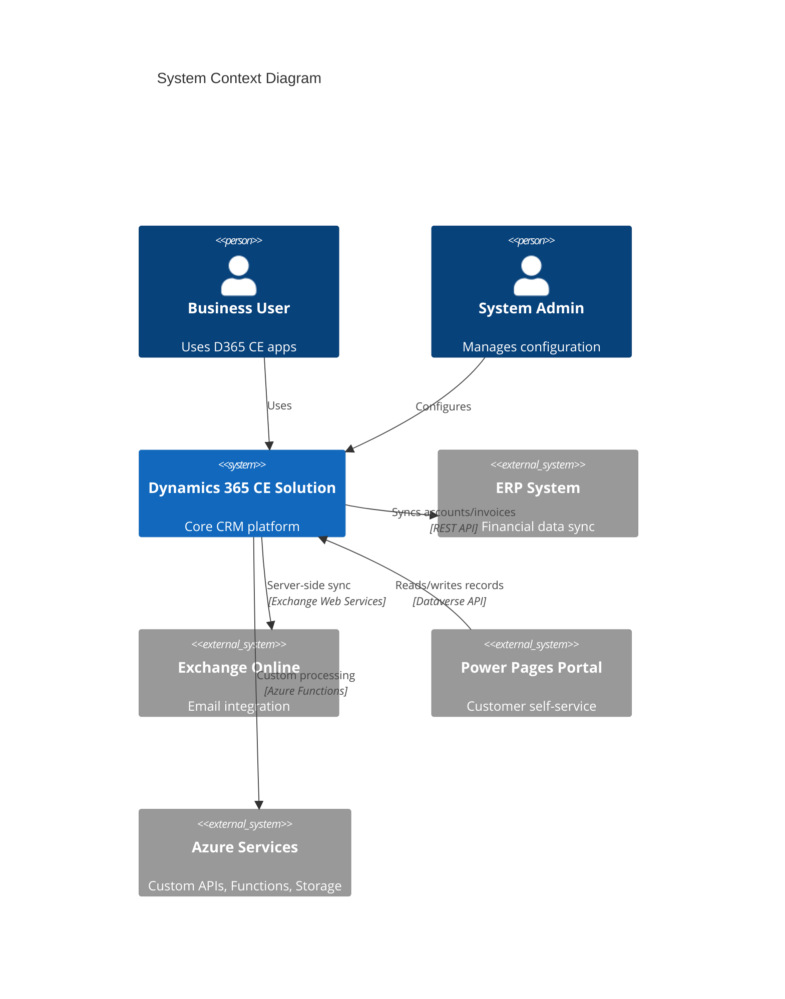
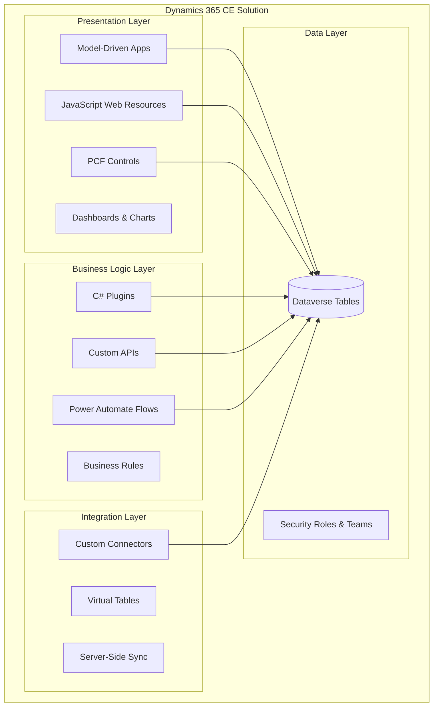
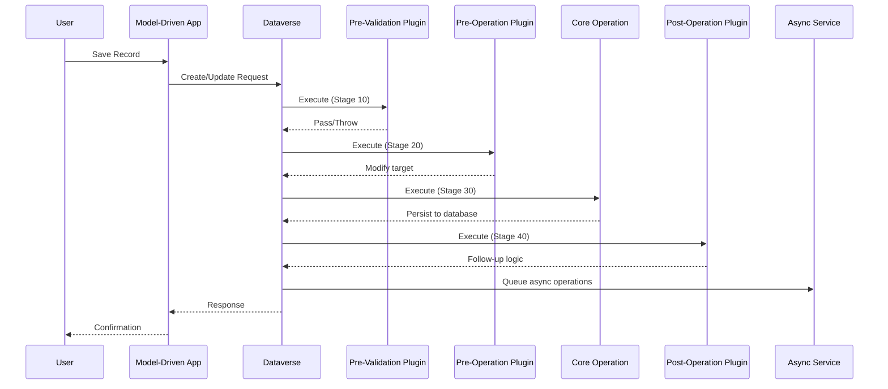
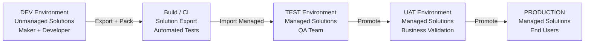

# arc42 Architecture Documentation for Dynamics 365 / Power Platform

> **Rule — Language:** Always respond to the user in the same language they use.

## When to Use This Skill

- Starting a new Dynamics 365 CE or Power Platform project that needs architecture documentation
- Reviewing or auditing an existing solution's architecture
- Preparing architecture artifacts for governance boards or stakeholder sign-off
- Documenting system design decisions and technical debt

## Prerequisites

- Access to the target Dataverse environment (via Dataverse MCP or manual)
- Understanding of the business domain and project scope
- Knowledge of existing integrations and external systems

## Generation Workflow

### Step 1 — Gather Environment Metadata

If Dataverse MCP is available, pull environment metadata first:

```
Use Dataverse MCP → list_tables to get the full table inventory.
Use Dataverse MCP → describe_table for each key entity to capture schema details.
Use Dataverse MCP → list_apps to identify model-driven apps in scope.
```

### Step 2 — Select Document Scope

Ask or determine which arc42 sections are needed. For a full architecture document, generate all 12 sections. For a lightweight review, focus on sections 1, 3, 5, 7, and 9.

### Step 3 — Generate the Document

Use the detailed template in `references/arc42-template.md` as the base. Fill in each section with project-specific content following the guidance below.

### Step 4 — Add Visual Diagrams

Use Mermaid notation for all diagrams. Minimum required diagrams:

1. **Context Diagram** (Section 3) — system boundary with external actors and integrations
2. **Building Block Diagram** (Section 5) — internal component decomposition
3. **Deployment Diagram** (Section 7) — environment topology and promotion pipeline

### Step 5 — Review and Validate

- Cross-check table names and relationships against Dataverse metadata
- Verify integration endpoints are current
- Validate security model against actual Dataverse security roles

---

## arc42 Sections — Dynamics 365 / Power Platform Adaptation

### Section 1: Introduction and Goals

**Purpose:** Define the project's business context, key stakeholders, and quality goals within the Dynamics 365 CE ecosystem.

**Content to include:**

- Business problem statement and D365 CE module scope (Sales, Service, Marketing, Custom)
- Key stakeholders (business owner, solution architect, D365 admin, ISV partners)
- Top 3–5 quality goals prioritized (e.g., performance under load, extensibility, data integrity)
- Functional requirements overview linking to user stories or FDD

**D365-specific considerations:**

- Specify which D365 CE modules are in scope (Sales Hub, Customer Service Hub, custom apps)
- Note whether this is a greenfield implementation, migration, or extension of existing CRM
- Document the Dynamics 365 license type (Professional, Enterprise, Premium) as it impacts available features

### Section 2: Architecture Constraints

**Purpose:** Document platform constraints, organizational policies, and technology decisions that bound the architecture.

**Mandatory constraints to document:**

| Category | Constraint | Impact |
|----------|-----------|--------|
| Platform | Dataverse API rate limits (6,000 requests/5 min per user) | Batch operations, integration throttling |
| Platform | Plugin execution timeout (2 min sync, 120 min async) | Long-running logic must use async patterns |
| Platform | Dataverse storage limits (per tenant/environment) | Data archival strategy needed |
| Platform | Solution layering and managed/unmanaged behavior | ALM strategy, solution segmentation |
| Licensing | Licensed user vs application user entitlements | Integration user strategy |
| Licensing | API call entitlements per license type | Integration volume planning |
| Organizational | Deployment windows and change management | Release cadence |
| Organizational | Data residency and compliance requirements | Environment geography |
| Technology | Supported browsers and mobile platforms | UI customization approach |
| Technology | .NET Framework version for plugins (4.6.2+) | NuGet package compatibility |

### Section 3: System Scope and Context

**Purpose:** Define the system boundary — what is inside the D365/Power Platform solution and what is external.

**Business Context:** Diagram showing users, external systems, and the D365/PP solution as a black box.



**Technical Context:** Document protocols, authentication methods, and data formats for each integration point.

| External System | Protocol | Authentication | Data Format | Direction |
|----------------|----------|---------------|-------------|-----------|
| ERP System | REST API | OAuth 2.0 Client Credentials | JSON | Bidirectional |
| Exchange Online | EWS/Graph | Server-side sync (SSS) | Email/Appointments | Bidirectional |
| Power Pages | Dataverse API | Azure AD B2C | OData JSON | Bidirectional |
| Azure Functions | HTTP Trigger | Managed Identity / App Registration | JSON | Outbound |

### Section 4: Solution Strategy

**Purpose:** Document the fundamental technology and design decisions, specifically the OOB vs. Low-Code vs. Pro-Code decision rationale.

**Decision Framework:**

```
For each business requirement, evaluate in this order:
1. OOB Configuration → Can it be done with out-of-the-box D365 features?
2. Low-Code Extension → Can Power Automate, Business Rules, or calculated columns solve it?
3. Pro-Code Extension → Is a C# plugin, custom API, PCF control, or Azure Function required?
```

**Technology choices to document:**

| Concern | Decision | Rationale |
|---------|----------|-----------|
| Business logic | OOB Business Rules / Plugins / Custom APIs | [Justify choice] |
| UI extensions | OOB forms / PCF controls / Web Resources | [Justify choice] |
| Integrations | Power Automate / Azure Logic Apps / Custom middleware | [Justify choice] |
| Reporting | Power BI embedded / SSRS / FetchXML reports | [Justify choice] |
| Portals | Power Pages / Custom React app | [Justify choice] |
| ALM | Azure DevOps / GitHub Actions + PAC CLI | [Justify choice] |

### Section 5: Building Block View

**Purpose:** Decompose the solution into its internal components — Dataverse tables, plugins, web resources, flows, PCF controls, and custom APIs.

**Level 1 — Solution Components:**



**Level 2 — Per component type:** For each building block, document:

- Component name and solution membership
- Purpose and responsibility
- Dependencies on other components
- Configuration / environment variable requirements

### Section 6: Runtime View

**Purpose:** Document key runtime scenarios showing how components interact during execution.

**Scenario 1 — Plugin Pipeline Execution:**



**Scenario 2 — Integration Flow Execution:**

Document the end-to-end flow for each major integration, showing message flow, error handling, and retry behavior.

**Scenario 3 — Power Automate Flow Execution:**

Document trigger → actions → error handling → completion for critical business flows.

### Section 7: Deployment View

**Purpose:** Document the environment topology and solution transport pipeline.

**Environment Topology:**



**ALM Pipeline:**

1. Developers work in DEV (unmanaged solutions)
2. CI pipeline exports solution → packs as managed → runs solution checker
3. CD pipeline imports managed solution to TEST → runs automated tests
4. On approval, promote to UAT → PROD
5. Use PAC CLI for solution operations:

```bash
# Export solution from DEV
pac solution export --name "MySolution" --path ./solutions/MySolution.zip --managed false

# Unpack for source control
pac solution unpack --zipfile ./solutions/MySolution.zip --folder ./src/MySolution --packagetype Both

# Pack managed solution for deployment
pac solution pack --folder ./src/MySolution --zipfile ./solutions/MySolution_managed.zip --packagetype Managed

# Import to target environment
pac solution import --path ./solutions/MySolution_managed.zip --activate-plugins true
```

### Section 8: Cross-cutting Concepts

**Topics to document:**

| Concept | Approach |
|---------|----------|
| **Security Model** | Security roles, business units, teams, field-level security, column security profiles |
| **Error Handling** | InvalidPluginExecutionException for plugins, try-catch-finally scopes in flows, global error handler in JS |
| **Logging & Tracing** | ITracingService in plugins, Application Insights for custom APIs, flow run history |
| **Auditing** | Dataverse audit log configuration, which tables/columns to audit |
| **Caching** | No in-memory caching in plugins (stateless), environment variables for config |
| **Localization** | Multi-language support via Dataverse translations, web resource resource files |
| **Data Archival** | Long-term retention strategy, Dataverse long-term retention, or Azure Data Lake |

### Section 9: Architecture Decisions

**Format:** Use Architecture Decision Records (ADR). For each key decision:

```markdown
## ADR-NNN: [Decision Title]

- **Status:** Proposed | Accepted | Deprecated | Superseded
- **Date:** YYYY-MM-DD
- **Context:** What is the issue that we're seeing that is motivating this decision?
- **Decision:** What is the change that we're proposing and/or doing?
- **Consequences:** What becomes easier or more difficult to do because of this change?
- **Alternatives Considered:** What other options were evaluated?
```

### Section 10: Quality Requirements

**Quality Tree:**

| Quality Attribute | Scenario | Metric | Target |
|------------------|----------|--------|--------|
| Performance | Page load time for main forms | Time to interactive | < 3 seconds |
| Performance | Plugin execution time (sync) | Duration | < 2 seconds |
| Reliability | System availability | Uptime | 99.9% (platform SLA) |
| Security | Data access | Role-based access compliance | 100% of records secured |
| Maintainability | Solution deployment | Zero-downtime deployment | < 30 min deployment window |
| Scalability | Concurrent users | Concurrent active sessions | Defined by license count |

### Section 11: Risks and Technical Debt

**Risk Register:**

| ID | Risk | Probability | Impact | Mitigation |
|----|------|------------|--------|------------|
| R1 | API throttling during peak integration | Medium | High | Implement retry with exponential backoff |
| R2 | Plugin depth limit causing cascade failures | Low | High | Depth check in all plugins |
| R3 | Unmanaged solution layers causing upgrade issues | Medium | Medium | Strict ALM governance |

**Technical Debt Tracking:**

Document known shortcuts, workarounds, and areas needing refactoring with estimated effort and priority.

### Section 12: Glossary

| Term | Definition |
|------|-----------|
| Dataverse | Microsoft's low-code data platform underlying D365 and Power Platform |
| OOB | Out of the box — standard platform functionality without customization |
| PCF | PowerApps Component Framework — custom UI controls |
| Plugin | C# server-side business logic executing in the Dataverse pipeline |
| Solution | Container for D365/PP customizations and components for ALM transport |
| FetchXML | Dataverse-specific XML query language |
| Web Resource | Client-side files (JS, HTML, CSS, images) deployed in Dataverse |
| Business Rule | Declarative client/server-side logic on Dataverse forms |
| Environment Variable | Configuration value stored in Dataverse, transportable across environments |
| Custom API | Reusable API endpoint registered in Dataverse, callable via Web API |
| ALM | Application Lifecycle Management — build, test, deploy pipeline |
| PAC CLI | Power Platform CLI for solution management and environment operations |

---

## References

- See `references/arc42-template.md` for the full blank template with placeholders
- [arc42 Official Documentation](https://arc42.org)
- [Microsoft Dynamics 365 Architecture Guidance](https://learn.microsoft.com/en-us/dynamics365/)
