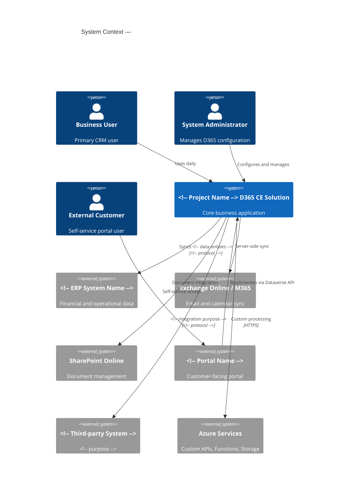
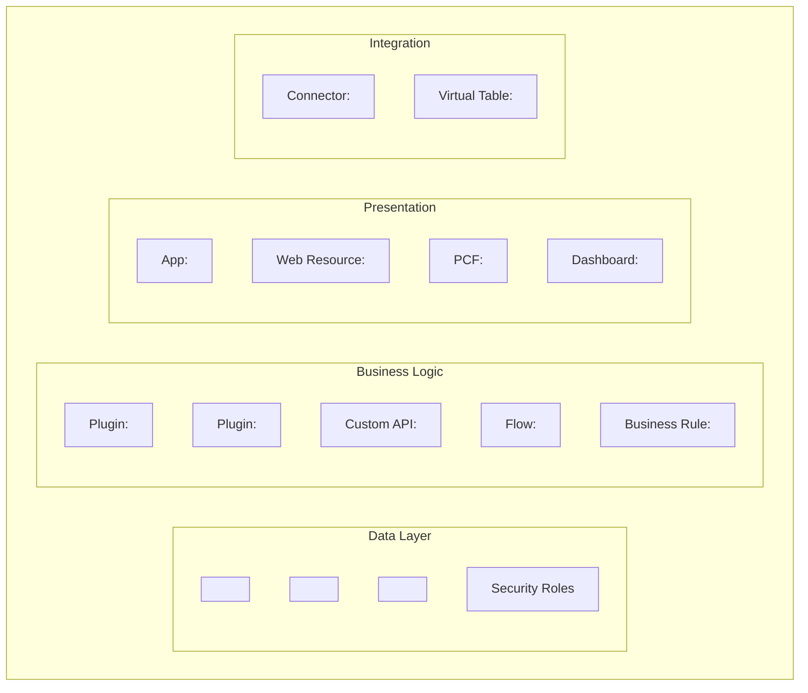
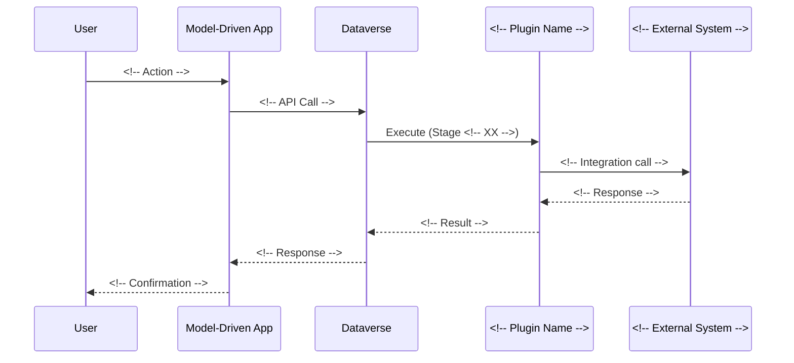
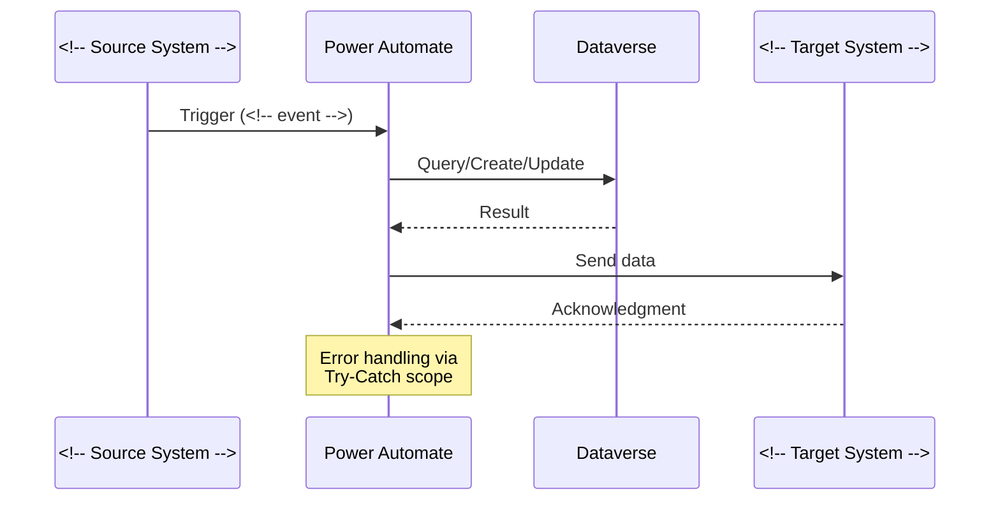
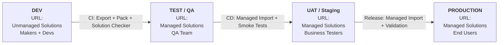
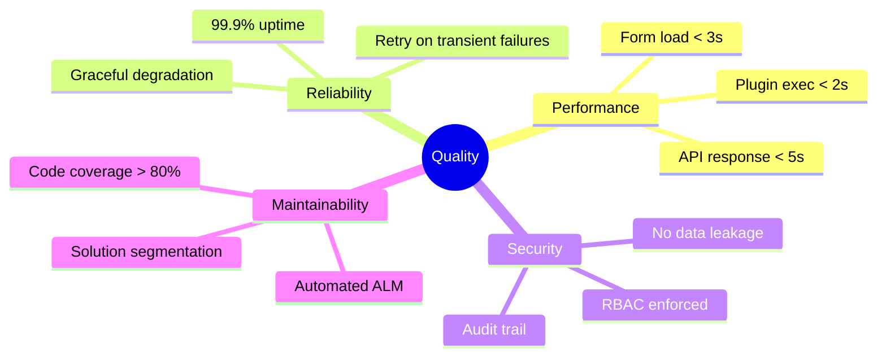

# arc42 Architecture Document — Dynamics 365 / Power Platform Template

> **Version:** 1.0
> **Date:** <!-- YYYY-MM-DD -->
> **Author:** <!-- Author Name -->
> **Project:** <!-- Project Name -->
> **Status:** Draft | Review | Approved

---

## Table of Contents

1. [Introduction and Goals](#1-introduction-and-goals)
2. [Architecture Constraints](#2-architecture-constraints)
3. [System Scope and Context](#3-system-scope-and-context)
4. [Solution Strategy](#4-solution-strategy)
5. [Building Block View](#5-building-block-view)
6. [Runtime View](#6-runtime-view)
7. [Deployment View](#7-deployment-view)
8. [Cross-cutting Concepts](#8-cross-cutting-concepts)
9. [Architecture Decisions](#9-architecture-decisions)
10. [Quality Requirements](#10-quality-requirements)
11. [Risks and Technical Debt](#11-risks-and-technical-debt)
12. [Glossary](#12-glossary)

---

## Version History

| Version | Date | Author | Changes |
|---------|------|--------|---------|
| 0.1 | <!-- date --> | <!-- name --> | Initial draft |
| 1.0 | <!-- date --> | <!-- name --> | First approved version |

---

## 1. Introduction and Goals

### 1.1 Business Context

<!-- Describe the business problem this solution addresses -->

**Project:** <!-- Project name -->
**D365 CE Modules in Scope:** <!-- Sales Hub / Customer Service Hub / Marketing / Custom / Field Service -->
**Implementation Type:** <!-- Greenfield / Migration from [system] / Extension of existing CRM -->

### 1.2 Requirements Overview

<!-- Top 3-5 business requirements driving the architecture -->

| ID | Requirement | Priority |
|----|-------------|----------|
| REQ-01 | <!-- requirement description --> | Must Have |
| REQ-02 | <!-- requirement description --> | Must Have |
| REQ-03 | <!-- requirement description --> | Should Have |

### 1.3 Quality Goals

| Priority | Quality Goal | Description |
|----------|-------------|-------------|
| 1 | <!-- e.g., Performance --> | <!-- e.g., Sub-3-second form load times --> |
| 2 | <!-- e.g., Security --> | <!-- e.g., Row-level data isolation between business units --> |
| 3 | <!-- e.g., Maintainability --> | <!-- e.g., Zero-downtime deployments via managed solutions --> |

### 1.4 Stakeholders

| Role | Name | Expectations |
|------|------|-------------|
| Business Owner | <!-- name --> | <!-- key expectation --> |
| Solution Architect | <!-- name --> | <!-- key expectation --> |
| D365 Administrator | <!-- name --> | <!-- key expectation --> |
| Development Lead | <!-- name --> | <!-- key expectation --> |
| QA Lead | <!-- name --> | <!-- key expectation --> |

---

## 2. Architecture Constraints

### 2.1 Platform Constraints

| Constraint | Description | Impact on Architecture |
|-----------|-------------|----------------------|
| Dataverse API Limits | 6,000 requests per 5 minutes per user (adjustable with capacity add-ons) | Integration design must use batching and throttling |
| Plugin Execution Timeout | 2 minutes (synchronous), 120 minutes (asynchronous) | Long-running operations must use async patterns or Azure Functions |
| Dataverse File Storage | 10 MB per file column attachment (configurable up to 128 MB) | Large file handling requires Azure Blob Storage |
| Solution Layering | Managed solutions create sealed layers; unmanaged customizations override | Strict solution segmentation and layering strategy required |
| Dataverse Storage | <!-- X --> GB included; <!-- Y --> per additional GB | Data archival strategy for historical records |
| Transaction Timeout | 30-minute max per plugin pipeline transaction | Complex operations need transaction splitting |

### 2.2 Licensing Constraints

| License Type | Count | Entitlements | Architectural Impact |
|-------------|-------|-------------|---------------------|
| D365 CE <!-- module --> | <!-- count --> | <!-- API calls, storage --> | <!-- impact --> |
| Power Automate per user | <!-- count --> | <!-- flow runs per month --> | <!-- impact --> |
| Application Users | <!-- count --> | <!-- for integrations --> | <!-- impact --> |

### 2.3 Organizational Constraints

| Constraint | Description |
|-----------|-------------|
| Deployment Windows | <!-- e.g., Weekends only, or any time with zero-downtime --> |
| Change Management | <!-- e.g., CAB approval required for PROD deployments --> |
| Data Residency | <!-- e.g., Data must reside in EU region --> |
| Compliance | <!-- e.g., GDPR, HIPAA, SOX requirements --> |

### 2.4 Technology Constraints

| Constraint | Description |
|-----------|-------------|
| Plugin .NET Version | .NET Framework 4.6.2+ (Dataverse sandbox) |
| Supported Browsers | Edge, Chrome, Firefox (latest 2 versions) |
| Mobile Platform | Dynamics 365 Mobile App (iOS/Android) |
| Source Control | <!-- Git / Azure DevOps Repos / GitHub --> |
| CI/CD Platform | <!-- Azure DevOps Pipelines / GitHub Actions --> |

---

## 3. System Scope and Context

### 3.1 Business Context

<!-- Replace placeholders with actual systems and actors -->



### 3.2 Technical Context

| External System | Direction | Protocol | Auth Method | Data Format | Frequency |
|----------------|-----------|----------|-------------|-------------|-----------|
| <!-- System --> | Inbound / Outbound / Bidirectional | REST / SOAP / File | OAuth 2.0 / API Key / Cert | JSON / XML / CSV | Real-time / Batch (schedule) |

---

## 4. Solution Strategy

### 4.1 Technology Decisions

| Concern | Decision | Alternatives Considered | Rationale |
|---------|----------|------------------------|-----------|
| Business Logic | <!-- OOB / Plugins / Custom APIs --> | <!-- list alternatives --> | <!-- why this choice --> |
| UI Customization | <!-- OOB Forms / PCF / Web Resources --> | <!-- list alternatives --> | <!-- why this choice --> |
| Integration | <!-- Power Automate / Logic Apps / Azure Functions --> | <!-- list alternatives --> | <!-- why this choice --> |
| Reporting | <!-- Power BI / SSRS / Dataverse Views --> | <!-- list alternatives --> | <!-- why this choice --> |
| Portal | <!-- Power Pages / Custom App --> | <!-- list alternatives --> | <!-- why this choice --> |
| ALM / CI/CD | <!-- Azure DevOps / GitHub Actions + PAC CLI --> | <!-- list alternatives --> | <!-- why this choice --> |
| Data Migration | <!-- SSIS / Data Migration Utility / Custom --> | <!-- list alternatives --> | <!-- why this choice --> |

### 4.2 Extension Decision Matrix

For each customization need, document the OOB → Low-Code → Pro-Code evaluation:

| Requirement | OOB Feasible? | Low-Code Feasible? | Pro-Code Required? | Chosen Approach |
|------------|--------------|--------------------|--------------------|-----------------|
| <!-- req --> | <!-- Yes/No + reason --> | <!-- Yes/No + reason --> | <!-- Yes/No + reason --> | <!-- chosen --> |

---

## 5. Building Block View

### 5.1 Level 1 — Solution Decomposition



### 5.2 Level 2 — Component Details

#### 5.2.1 Dataverse Tables

| Table (Logical Name) | Display Name | Type | Purpose | Key Relationships |
|----------------------|-------------|------|---------|-------------------|
| <!-- crXXX_tablename --> | <!-- Display --> | Custom / OOB Extended | <!-- purpose --> | <!-- N:1 to account, etc. --> |

#### 5.2.2 Plugins

| Plugin Class | Table | Message | Stage | Mode | Purpose |
|-------------|-------|---------|-------|------|---------|
| <!-- ClassName --> | <!-- table --> | Create / Update / Delete | PreValidation / PreOperation / PostOperation | Sync / Async | <!-- purpose --> |

#### 5.2.3 Custom APIs

| Name | Binding | Request Params | Response Params | Purpose |
|------|---------|---------------|-----------------|---------|
| <!-- api_name --> | Global / Entity | <!-- params --> | <!-- params --> | <!-- purpose --> |

#### 5.2.4 Web Resources

| Name | Type | Purpose | Forms Used On |
|------|------|---------|--------------|
| <!-- name --> | JS / HTML / CSS | <!-- purpose --> | <!-- form list --> |

#### 5.2.5 PCF Controls

| Name | Bound Property | Framework | Purpose |
|------|---------------|-----------|---------|
| <!-- name --> | <!-- field type --> | React / Raw DOM | <!-- purpose --> |

#### 5.2.6 Power Automate Flows

| Name | Trigger | Type | Purpose | Error Handling |
|------|---------|------|---------|---------------|
| <!-- name --> | Dataverse trigger / HTTP / Scheduled | Automated / Instant / Scheduled | <!-- purpose --> | Try-Catch scope / Retry policy |

---

## 6. Runtime View

### 6.1 Key Scenario: <!-- Scenario Name -->



### 6.2 Key Scenario: <!-- Integration Flow Name -->

<!-- Add sequence diagram for key integration scenarios -->



---

## 7. Deployment View

### 7.1 Environment Topology



### 7.2 Solution Architecture

| Solution Name | Type | Components | Dependencies |
|--------------|------|-----------|-------------|
| <!-- SolutionName -->_Core | Managed | Tables, Security Roles, Sitemap | None |
| <!-- SolutionName -->_Plugins | Managed | Plugin assemblies, Custom APIs | Core |
| <!-- SolutionName -->_UI | Managed | Web Resources, PCF, Dashboards | Core |
| <!-- SolutionName -->_Flows | Managed | Power Automate Flows, Connection Refs, Env Vars | Core, Plugins |

### 7.3 CI/CD Pipeline

```bash
# 1. Export from DEV
pac solution export --name "<!-- SolutionName -->" --path ./export/solution.zip --managed false

# 2. Unpack for source control
pac solution unpack --zipfile ./export/solution.zip --folder ./src/<!-- SolutionName --> --packagetype Both

# 3. Run solution checker
pac solution check --path ./export/solution_managed.zip --outputDirectory ./reports

# 4. Pack managed for deployment
pac solution pack --folder ./src/<!-- SolutionName --> --zipfile ./deploy/solution_managed.zip --packagetype Managed

# 5. Import to target environment
pac auth create --environment <!-- target-env-url -->
pac solution import --path ./deploy/solution_managed.zip --activate-plugins true --force-overwrite true

# 6. Publish customizations
pac solution publish
```

### 7.4 Deployment Checklist

- [ ] All solutions exported and version-bumped
- [ ] Solution checker passes with no critical issues
- [ ] Automated tests pass in TEST environment
- [ ] UAT sign-off obtained
- [ ] Rollback plan documented
- [ ] Connection references configured for target environment
- [ ] Environment variables set for target environment
- [ ] Post-deployment data scripts identified

---

## 8. Cross-cutting Concepts

### 8.1 Security Model

| Security Layer | Implementation |
|---------------|---------------|
| Authentication | Azure AD / Entra ID |
| Authorization | Dataverse Security Roles assigned to Teams |
| Row-Level Security | Business Unit hierarchy + sharing rules |
| Field-Level Security | Column security profiles for sensitive fields |
| API Security | Application Users with minimum-privilege roles |

### 8.2 Error Handling Strategy

| Component | Pattern | Detail |
|-----------|---------|--------|
| C# Plugins | InvalidPluginExecutionException | User-friendly messages; catch and wrap internal exceptions |
| Web Resources | try-catch + Xrm.Navigation.openAlertDialog | Structured error display; log to console in DEV |
| Power Automate | Try-Catch-Finally scope | Configure run-after for failed/timed-out; send alerts |
| Custom APIs | Structured error response | Return error codes in output parameters |

### 8.3 Logging and Monitoring

| Component | Logging Mechanism |
|-----------|------------------|
| Plugins | ITracingService (viewable in Plugin Trace Log) |
| Custom APIs / Azure Functions | Application Insights |
| Power Automate | Flow run history (28-day retention) |
| Client-side | Browser console + custom telemetry (App Insights JS SDK) |

### 8.4 Auditing

**Audited Tables:** <!-- list tables with auditing enabled -->
**Audited Columns:** <!-- list specific columns or "All" -->
**Retention:** <!-- audit log retention period -->

---

## 9. Architecture Decisions

### ADR-001: <!-- Decision Title -->

- **Status:** Proposed | Accepted | Deprecated | Superseded
- **Date:** <!-- YYYY-MM-DD -->
- **Deciders:** <!-- names or roles -->
- **Context:** <!-- What is the issue motivating this decision? -->
- **Decision:** <!-- What is the decision taken? -->
- **Consequences:**
  - Positive: <!-- what becomes easier -->
  - Negative: <!-- what becomes harder -->
- **Alternatives Considered:**
  1. <!-- Alternative 1 --> — Rejected because <!-- reason -->
  2. <!-- Alternative 2 --> — Rejected because <!-- reason -->

### ADR-002: <!-- Decision Title -->

<!-- Repeat template -->

---

## 10. Quality Requirements

### 10.1 Quality Tree



### 10.2 Quality Scenarios

| ID | Quality Attribute | Scenario | Stimulus | Response | Metric | Target |
|----|------------------|----------|----------|----------|--------|--------|
| QS-01 | Performance | User opens main form | Form load request | Form renders with data | Load time | < 3 sec |
| QS-02 | Performance | Sync plugin fires on save | Record save | Plugin completes | Execution time | < 2 sec |
| QS-03 | Reliability | Integration endpoint down | API call fails | Retry with backoff; alert | Recovery time | < 15 min |
| QS-04 | Security | Unauthorized data access attempt | API request without role | Access denied response | Compliance | 100% |

---

## 11. Risks and Technical Debt

### 11.1 Risk Register

| ID | Risk | Probability | Impact | Mitigation | Owner | Status |
|----|------|------------|--------|------------|-------|--------|
| R-01 | <!-- risk description --> | Low / Medium / High | Low / Medium / High | <!-- mitigation strategy --> | <!-- owner --> | Open / Mitigated |

### 11.2 Technical Debt

| ID | Description | Introduced | Estimated Effort | Priority | Plan |
|----|------------|-----------|-----------------|----------|------|
| TD-01 | <!-- debt description --> | <!-- date/sprint --> | <!-- hours/days --> | Low / Medium / High | <!-- remediation plan --> |

---

## 12. Glossary

| Term | Definition |
|------|-----------|
| Dataverse | Microsoft's low-code data platform underlying Dynamics 365 and Power Platform |
| OOB | Out of the Box — standard platform functionality without customization |
| PCF | PowerApps Component Framework — framework for building custom UI controls |
| Plugin | C# assembly executing server-side logic in the Dataverse event pipeline |
| Solution | Packaging container for D365/PP customizations, used for ALM transport |
| FetchXML | Dataverse-specific XML-based query language |
| Web Resource | Client-side files (JS, HTML, CSS, images) stored in Dataverse |
| Business Rule | Declarative logic applied to Dataverse forms (client-side) or table (server-side) |
| Environment Variable | Solution-aware configuration value transportable across environments |
| Custom API | Reusable Dataverse API endpoint, callable via OData/Web API |
| ALM | Application Lifecycle Management — the discipline of managing solution lifecycle |
| PAC CLI | Power Platform CLI — command-line tool for solution management |
| Model-Driven App | A D365/PP app that derives its UI from the data model and metadata |
| Managed Solution | A sealed solution package for deployment to downstream environments |
| Unmanaged Solution | An editable solution used in development environments |
| Server-Side Sync | Dataverse feature that synchronizes email, appointments, and contacts with Exchange |
| Virtual Table | A Dataverse table that retrieves data from an external source at runtime |
| Custom Connector | A Power Platform connector wrapping a custom REST API |

---

<!-- END OF TEMPLATE -->
