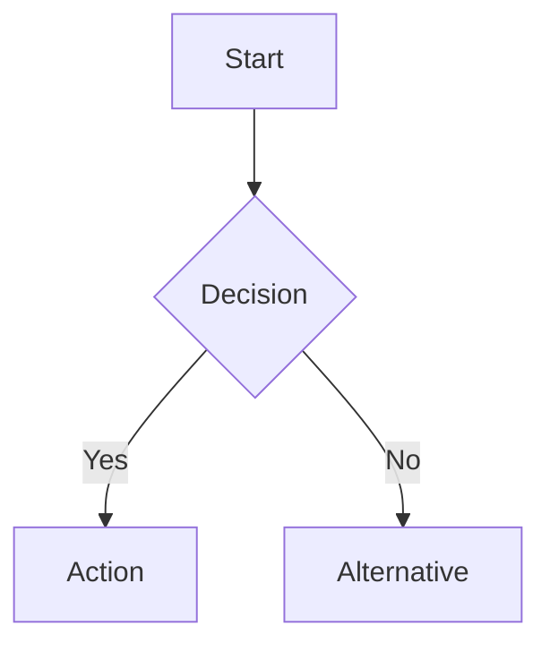

# Documentation Generator for Dynamics 365 / Power Platform

> **Rule — Language:** Always respond to the user in the same language they use.

## When to Use This Skill

- Creating project documentation from scratch using standardized templates
- Generating technical or functional design documents from codebase analysis
- Producing deployment guides for solution transport across environments
- Writing release notes for a new version or sprint delivery
- Documenting data migration specifications or integration designs

## Supported Document Types

| Document Type | Abbreviation | Primary Audience | When to Generate |
|--------------|-------------|-----------------|-----------------|
| Technical Design Document | TDD | Developers, Architects | Before development starts or during solution design |
| Functional Design Document | FDD | Business Analysts, Stakeholders | After requirements gathering, before development |
| Deployment Guide | DG | DevOps, Admins | Before each release / deployment |
| User Manual | UM | End Users | After development, before UAT or go-live |
| Release Notes | RN | All Stakeholders | At each release or sprint completion |
| Data Migration Spec | DMS | Data Engineers, Developers | Before data migration execution |
| Integration Spec | IS | Integration Developers | Before integration development starts |

---

## Generation Workflow

### Step 1 — Analyze Source Material

Determine what information is available:

**If Dataverse MCP is available:**

```
Use Dataverse MCP → list_tables to inventory all tables in the solution.
Use Dataverse MCP → describe_table for each key table to get schema (columns, types, relationships).
Use Dataverse MCP → list_apps to identify model-driven apps.
Use Dataverse MCP → read_query to sample data or check record counts.
```

**If GitHub MCP is available:**

```
Use GitHub MCP → get_file_contents to read source code for technical documentation.
Use GitHub MCP → list_commits to build release history.
Use GitHub MCP → pull_request_read to gather change details for release notes.
```

**If working from requirements:**

- Read user stories, functional specifications, or business process documents
- Identify key entities, processes, and integration points

### Step 2 — Select Document Type and Template

Based on the user's request, select the appropriate template from `references/doc-templates.md`.

| User Request | Template to Use |
|-------------|----------------|
| "Create a TDD" / "Document the solution design" | Technical Design Document |
| "Write a functional spec" / "Document the requirements" | Functional Design Document |
| "Create deployment instructions" | Deployment Guide |
| "Write a user guide" / "Create end-user documentation" | User Manual |
| "Generate release notes" | Release Notes |
| "Document the data migration" | Data Migration Spec |
| "Document the integration" / "Create an API spec" | Integration Spec |

### Step 3 — Generate the Document

Follow these steps for each document:

1. **Copy the template structure** from `references/doc-templates.md`
2. **Fill the metadata header** — title, version, date, author, status
3. **Populate each section** with project-specific content
4. **Add diagrams** where indicated using Mermaid notation
5. **Add version history** table entry
6. **Insert table of contents** at the top

### Step 4 — Include Diagrams

Use Mermaid for all diagrams. Required diagram types by document:

| Document | Required Diagrams |
|----------|------------------|
| TDD | Data model (ERD), component architecture, deployment topology |
| FDD | Business process flows, use case diagrams |
| Deployment Guide | Environment topology, pipeline flow |
| User Manual | Process flow diagrams (simplified) |
| Data Migration Spec | Source-to-target mapping diagram, ETL flow |
| Integration Spec | Sequence diagrams for each endpoint |

### Step 5 — Review and Validate

- Cross-check table/column names against Dataverse metadata
- Verify all referenced components exist in the solution
- Ensure version numbers are consistent
- Check that all placeholders have been replaced

---

## Formatting Standards

### Markdown Structure

All documents must follow this structure:

```markdown
# Document Title

> **Version:** X.Y | **Date:** YYYY-MM-DD | **Status:** Draft/Review/Approved

## Table of Contents
<!-- auto-generated or manual TOC -->

## Version History
| Version | Date | Author | Changes |
|---------|------|--------|---------|

## 1. Section Title
### 1.1 Subsection
<!-- content -->
```

### Heading Hierarchy

- `#` — Document title (one per document)
- `##` — Major sections (numbered: 1, 2, 3…)
- `###` — Subsections (numbered: 1.1, 1.2…)
- `####` — Sub-subsections (numbered: 1.1.1, 1.1.2…)

### Tables

Use markdown tables for structured data. Include a header row and alignment:

```markdown
| Column 1 | Column 2 | Column 3 |
|----------|----------|----------|
| data     | data     | data     |
```

### Diagrams

All diagrams use Mermaid notation enclosed in fenced code blocks:

````markdown

````

### Code Blocks

Use fenced code blocks with language identifiers:

````markdown
```csharp
// C# example
```

```javascript
// JavaScript example
```

```bash
# CLI commands
```
````

---

## Document Type Details

### Technical Design Document (TDD)

**Purpose:** Capture the complete technical solution design before or during development.

**Sections:**

1. **Introduction** — Purpose, scope, audience, related documents
2. **Solution Overview** — High-level architecture, D365 modules in scope
3. **Data Model** — Tables, columns, relationships, option sets (with Mermaid ERD)
4. **Business Logic** — Plugins, custom APIs, business rules, calculated columns
5. **UI Design** — Model-driven app structure, forms, views, dashboards, PCF controls
6. **Integration Design** — External system connections, protocols, data mapping
7. **Security Design** — Security roles, business units, field-level security
8. **Deployment Design** — Solutions, environments, ALM pipeline
9. **Testing Strategy** — Unit tests, integration tests, UAT approach
10. **Non-Functional Requirements** — Performance, scalability, availability

### Functional Design Document (FDD)

**Purpose:** Translate business requirements into functional specifications that developers can implement.

**Sections:**

1. **Introduction** — Business context, objectives, assumptions
2. **Business Process Overview** — Current state, future state, gap analysis
3. **Functional Requirements** — Detailed requirements with acceptance criteria
4. **Process Flows** — Step-by-step business processes (with Mermaid flowcharts)
5. **User Stories** — Formatted as "As a [role], I want [feature], so that [benefit]"
6. **Data Requirements** — Entities, attributes, business rules
7. **UI/UX Requirements** — Screen layouts, navigation, user experience
8. **Reporting Requirements** — Reports, dashboards, analytics
9. **Migration Requirements** — Data migration from legacy systems
10. **Acceptance Criteria** — Testable conditions for sign-off

### Deployment Guide

**Purpose:** Provide step-by-step instructions for deploying the solution to target environments.

**Sections:**

1. **Overview** — Release version, target environment, deployment window
2. **Prerequisites** — Environment readiness, access requirements, backups
3. **Pre-Deployment Steps** — Data backups, notification to users, maintenance mode
4. **Deployment Steps** — Ordered solution import steps with CLI commands
5. **Post-Deployment Steps** — Publish customizations, activate flows, verify connections
6. **Verification** — Smoke tests, validation queries, health checks
7. **Rollback Plan** — Steps to revert if deployment fails
8. **Known Issues** — Issues to watch for during deployment

**Key CLI commands to include:**

```bash
# Authenticate to target environment
pac auth create --environment https://[org].crm.dynamics.com

# Import solutions in dependency order
pac solution import --path ./solutions/Core_managed.zip --activate-plugins true
pac solution import --path ./solutions/Plugins_managed.zip --activate-plugins true
pac solution import --path ./solutions/UI_managed.zip --activate-plugins true
pac solution import --path ./solutions/Flows_managed.zip --activate-plugins true

# Publish all customizations
pac solution publish

# Verify import status
pac solution list
```

### User Manual

**Purpose:** Provide end-user instructions for using the Dynamics 365 solution.

**Sections:**

1. **Getting Started** — Login, navigation, home screen overview
2. **Core Processes** — Step-by-step instructions for each business process
3. **Data Entry** — How to create, edit, and search records
4. **Reports and Dashboards** — How to access and interpret reports
5. **Mobile Access** — Using D365 mobile app
6. **Tips and Shortcuts** — Productivity tips, keyboard shortcuts
7. **FAQ** — Common questions and answers
8. **Troubleshooting** — Common issues and resolutions
9. **Support Contact** — How to get help

### Release Notes

**Purpose:** Communicate what changed in a release to all stakeholders.

**Sections:**

1. **Release Overview** — Version, date, sprint/iteration, highlights
2. **New Features** — New capabilities with descriptions
3. **Improvements** — Enhancements to existing features
4. **Bug Fixes** — Resolved defects with work item references
5. **Known Issues** — Open issues with workarounds
6. **Breaking Changes** — Changes that require user action or training
7. **Deployment Notes** — Special deployment instructions for this release
8. **Upgrade Instructions** — Steps for environments already running previous version

### Data Migration Spec

**Purpose:** Document the complete data migration plan from source to target.

**Sections:**

1. **Overview** — Migration scope, source systems, target Dataverse environment
2. **Source Data Analysis** — Source tables, row counts, data quality assessment
3. **Target Data Model** — Dataverse tables, columns, relationships
4. **Field Mapping** — Source-to-target column mapping with transformations
5. **Transformation Rules** — Data cleansing, format conversion, value mapping
6. **Load Sequence** — Dependency-ordered table load sequence
7. **Validation Rules** — Post-migration validation queries and expected results
8. **Rollback Plan** — How to reverse a failed migration
9. **Performance Estimates** — Expected duration, batch sizes, resource requirements

### Integration Spec

**Purpose:** Document each integration endpoint with full technical detail.

**Sections:**

1. **Overview** — Integration purpose, systems involved, data direction
2. **Architecture** — Integration pattern (real-time, batch, event-driven)
3. **Authentication** — Auth method, token management, credential storage
4. **Endpoints** — URL, method, headers, request/response schemas
5. **Data Mapping** — Field-level mapping between systems
6. **Error Handling** — Error codes, retry strategy, dead-letter handling
7. **Monitoring** — Logging, alerting, dashboard
8. **SLA** — Availability, throughput, latency requirements
9. **Testing** — Test scenarios, mock data, environment setup

---

## Quick-Start Examples

### Generate a TDD from Dataverse Metadata

```
1. Use Dataverse MCP → list_tables to get all tables
2. Use Dataverse MCP → describe_table for each key table
3. Select TDD template from references/doc-templates.md
4. Fill Section 3 (Data Model) with table schemas
5. Generate Mermaid ERD from relationships
6. Fill remaining sections from project context
```

### Generate Release Notes from Git History

```
1. Use GitHub MCP → list_commits (since last release tag)
2. Use GitHub MCP → search_pull_requests (merged since last release)
3. Categorize changes: Features / Improvements / Bug Fixes
4. Select Release Notes template
5. Fill sections with categorized changes
6. Add known issues from open bug tickets
```

### Generate a Deployment Guide

```
1. Identify solutions to deploy (list_tables scoped to app)
2. Determine solution dependency order
3. Select Deployment Guide template
4. Fill pre-deployment, deployment, and post-deployment steps
5. Include PAC CLI commands for each step
6. Add verification queries and rollback plan
```

---

## References

- See `references/doc-templates.md` for full templates with placeholders
- [Microsoft D365 Documentation Standards](https://learn.microsoft.com/en-us/dynamics365/)
- [Mermaid Diagram Syntax](https://mermaid.js.org/intro/)
