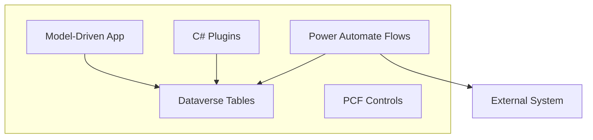
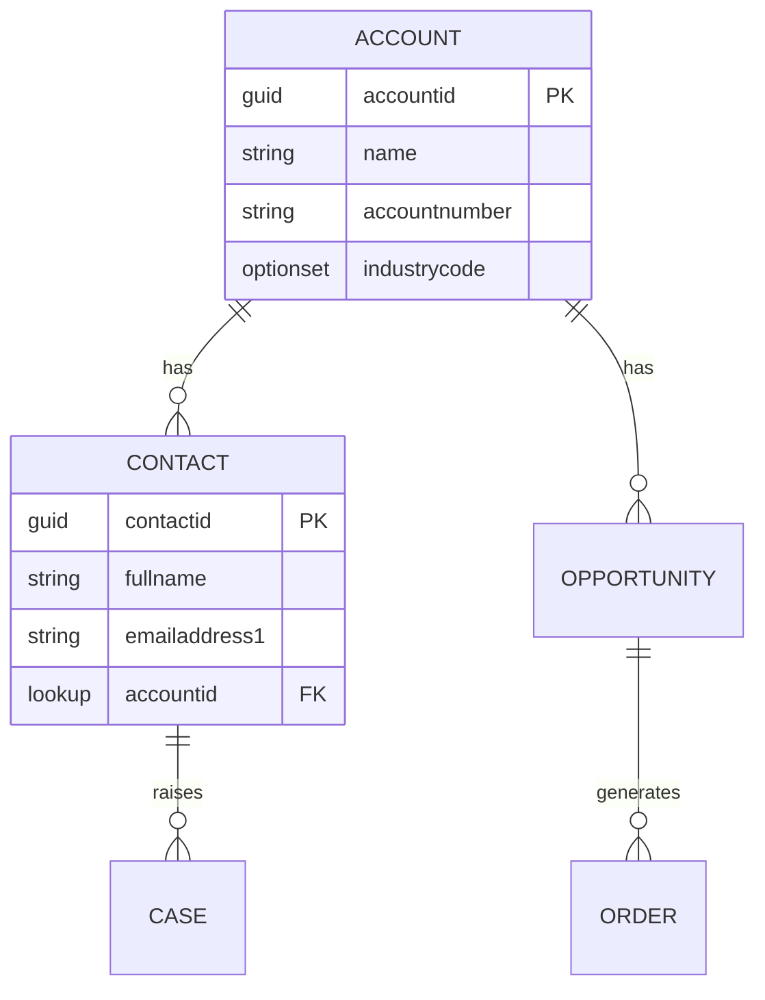
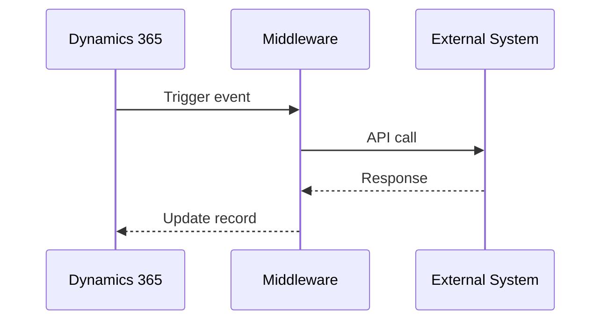
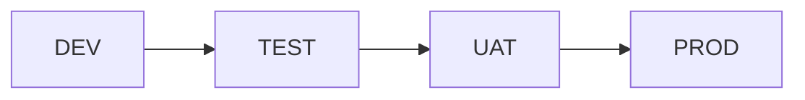
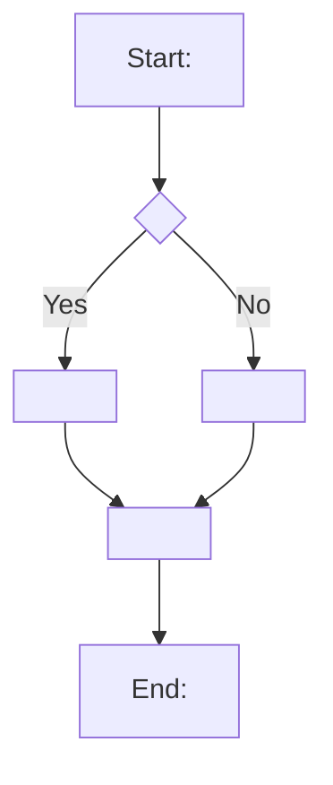
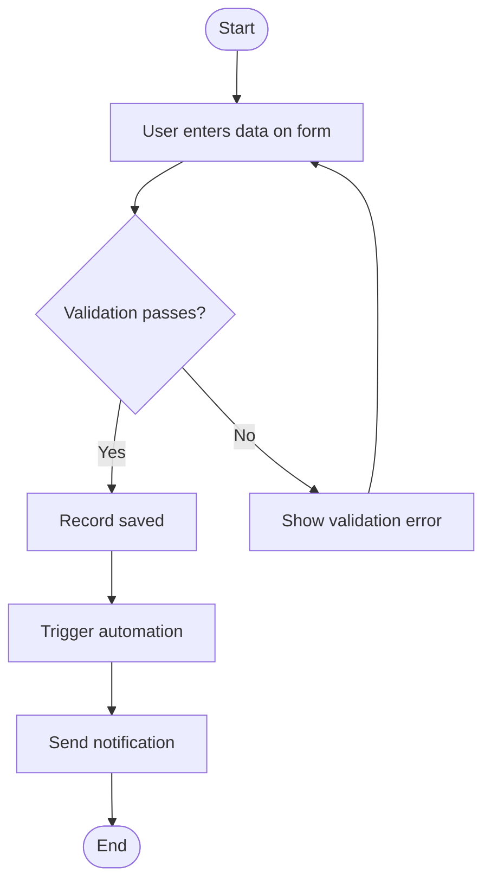
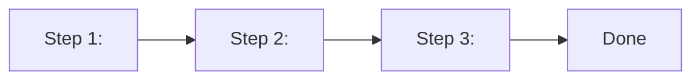
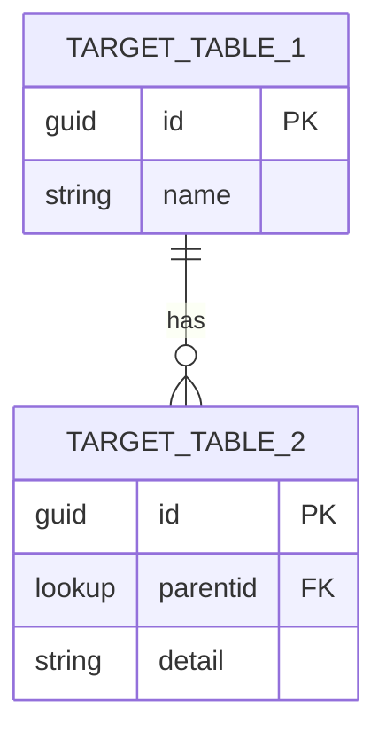
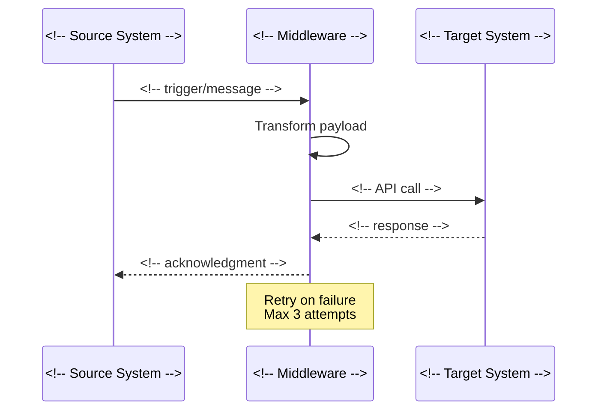

# Document Templates — Dynamics 365 / Power Platform

> Copy the relevant template section below and fill in the placeholders for your project.

---

## Table of Contents

1. [Technical Design Document (TDD)](#1-technical-design-document-tdd)
2. [Functional Design Document (FDD)](#2-functional-design-document-fdd)
3. [Deployment Guide](#3-deployment-guide)
4. [User Manual](#4-user-manual)
5. [Release Notes](#5-release-notes)
6. [Data Migration Spec](#6-data-migration-spec)
7. [Integration Spec](#7-integration-spec)

---

## 1. Technical Design Document (TDD)

```markdown
# Technical Design Document — <!-- Project/Feature Name -->

> **Version:** 1.0 | **Date:** <!-- YYYY-MM-DD --> | **Status:** Draft
> **Author:** <!-- Author Name --> | **Reviewer:** <!-- Reviewer Name -->

## Table of Contents

1. Introduction
2. Solution Overview
3. Data Model
4. Business Logic
5. UI Design
6. Integration Design
7. Security Design
8. Deployment Design
9. Testing Strategy
10. Non-Functional Requirements

## Version History

| Version | Date | Author | Changes |
|---------|------|--------|---------|
| 0.1 | <!-- date --> | <!-- name --> | Initial draft |
| 1.0 | <!-- date --> | <!-- name --> | Approved |

---

## 1. Introduction

### 1.1 Purpose

This document describes the technical design for <!-- feature/project name -->
within the <!-- D365 module: Sales/Service/Custom --> module.

### 1.2 Scope

- **In Scope:** <!-- list what is covered -->
- **Out of Scope:** <!-- list exclusions -->

### 1.3 Related Documents

| Document | Location |
|----------|----------|
| Functional Design | <!-- link --> |
| Architecture Decision Records | <!-- link --> |
| User Stories | <!-- work item IDs --> |

---

## 2. Solution Overview

### 2.1 Solution Architecture

<!-- High-level description of the solution -->



### 2.2 D365 Modules and Components

| Component Type | Count | Description |
|---------------|-------|-------------|
| Custom Tables | <!-- N --> | <!-- brief description --> |
| Plugins | <!-- N --> | <!-- brief description --> |
| Web Resources | <!-- N --> | <!-- brief description --> |
| Flows | <!-- N --> | <!-- brief description --> |
| PCF Controls | <!-- N --> | <!-- brief description --> |
| Security Roles | <!-- N --> | <!-- brief description --> |

---

## 3. Data Model

### 3.1 Entity Relationship Diagram



### 3.2 Table Definitions

#### <!-- Table Display Name --> (`<!-- logical_name -->`)

| Column | Display Name | Type | Required | Description |
|--------|-------------|------|----------|-------------|
| <!-- crXXX_field --> | <!-- Display --> | String / Lookup / OptionSet / etc. | Yes/No | <!-- purpose --> |

#### Relationships

| Type | Related Table | Lookup Column | Cascade |
|------|-------------|--------------|---------|
| N:1 | <!-- parent table --> | <!-- lookup field --> | <!-- cascade behavior --> |
| 1:N | <!-- child table --> | <!-- child lookup --> | <!-- cascade behavior --> |

---

## 4. Business Logic

### 4.1 Plugin Registration

| Plugin Class | Table | Message | Stage | Mode | Description |
|-------------|-------|---------|-------|------|-------------|
| <!-- Namespace.ClassName --> | <!-- table --> | Create/Update | PreOperation/PostOperation | Sync/Async | <!-- purpose --> |

### 4.2 Plugin Logic Detail

#### <!-- Plugin Name -->

- **Trigger:** On <!-- message --> of <!-- table -->
- **Stage:** <!-- PreValidation/PreOperation/PostOperation -->
- **Input:** <!-- what data is read from context -->
- **Logic:**
  1. <!-- step 1 -->
  2. <!-- step 2 -->
  3. <!-- step 3 -->
- **Output:** <!-- what is modified or created -->
- **Error Handling:** <!-- how errors are reported -->

### 4.3 Business Rules

| Table | Rule Name | Scope | Condition | Action |
|-------|----------|-------|-----------|--------|
| <!-- table --> | <!-- name --> | Entity/Form | <!-- condition --> | <!-- action --> |

### 4.4 Custom APIs

| API Name | Binding | Description |
|----------|---------|-------------|
| <!-- api --> | Global/Entity | <!-- what it does --> |

**Request Parameters:**

| Name | Type | Required | Description |
|------|------|----------|-------------|
| <!-- param --> | <!-- type --> | Yes/No | <!-- description --> |

**Response Properties:**

| Name | Type | Description |
|------|------|-------------|
| <!-- prop --> | <!-- type --> | <!-- description --> |

---

## 5. UI Design

### 5.1 Model-Driven App Structure

| App Name | Modules | Tables | Purpose |
|----------|---------|--------|---------|
| <!-- app --> | <!-- modules --> | <!-- tables --> | <!-- purpose --> |

### 5.2 Form Design

#### <!-- Table Name --> — Main Form

| Tab | Section | Fields | Visibility Rule |
|-----|---------|--------|----------------|
| <!-- tab --> | <!-- section --> | <!-- fields --> | <!-- rule or Always --> |

### 5.3 View Design

| View Name | Table | Type | Columns | Default Filter |
|-----------|-------|------|---------|---------------|
| <!-- name --> | <!-- table --> | Public/Personal | <!-- columns --> | <!-- filter --> |

---

## 6. Integration Design

### 6.1 Integration Overview



### 6.2 Integration Points

| ID | Source | Target | Trigger | Frequency | Protocol |
|----|--------|--------|---------|-----------|----------|
| INT-01 | <!-- source --> | <!-- target --> | <!-- trigger --> | <!-- freq --> | <!-- protocol --> |

---

## 7. Security Design

### 7.1 Security Roles

| Role Name | Tables | Create | Read | Write | Delete | Scope |
|-----------|--------|--------|------|-------|--------|-------|
| <!-- role --> | <!-- table --> | ✅/❌ | BU/Org/User | ✅/❌ | ✅/❌ | <!-- scope --> |

### 7.2 Field-Level Security

| Table | Column | Profile | Access |
|-------|--------|---------|--------|
| <!-- table --> | <!-- column --> | <!-- profile name --> | Read/Write/Create |

---

## 8. Deployment Design

### 8.1 Solution Structure

| Solution | Type | Components | Dependencies |
|----------|------|-----------|-------------|
| <!-- name --> | Managed | <!-- components --> | <!-- deps --> |

### 8.2 Environment Pipeline



---

## 9. Testing Strategy

| Test Type | Scope | Tool | Responsibility |
|-----------|-------|------|---------------|
| Unit Tests | Plugin logic | xUnit / NUnit | Developer |
| Integration Tests | API endpoints | Postman / automated | Developer |
| UI Tests | Forms and navigation | EasyRepro / manual | QA |
| UAT | Business processes | Manual | Business Users |

---

## 10. Non-Functional Requirements

| Requirement | Target | Measurement |
|------------|--------|-------------|
| Form load time | < 3 seconds | Browser dev tools |
| Plugin execution | < 2 seconds (sync) | Plugin trace log |
| System availability | 99.9% | Platform SLA |
| Concurrent users | <!-- N --> | Load testing |
```

---

## 2. Functional Design Document (FDD)

```markdown
# Functional Design Document — <!-- Feature/Process Name -->

> **Version:** 1.0 | **Date:** <!-- YYYY-MM-DD --> | **Status:** Draft
> **Author:** <!-- Author Name -->

## Version History

| Version | Date | Author | Changes |
|---------|------|--------|---------|
| 0.1 | <!-- date --> | <!-- name --> | Initial draft |

---

## 1. Introduction

### 1.1 Business Context

<!-- Describe the business problem or opportunity -->

### 1.2 Objectives

1. <!-- objective 1 -->
2. <!-- objective 2 -->
3. <!-- objective 3 -->

### 1.3 Assumptions and Constraints

| Type | Description |
|------|-------------|
| Assumption | <!-- assumption --> |
| Constraint | <!-- constraint --> |

---

## 2. Business Process Overview

### 2.1 Current State (As-Is)

<!-- Describe the current process -->

### 2.2 Future State (To-Be)



### 2.3 Gap Analysis

| Current State | Future State | Gap | Solution |
|--------------|-------------|-----|---------|
| <!-- current --> | <!-- future --> | <!-- gap --> | <!-- how D365 solves it --> |

---

## 3. Functional Requirements

### FR-01: <!-- Requirement Title -->

- **Priority:** Must Have / Should Have / Could Have
- **Description:** <!-- detailed description -->
- **Business Rule:** <!-- associated business rule -->
- **Acceptance Criteria:**
  - [ ] <!-- criterion 1 -->
  - [ ] <!-- criterion 2 -->
  - [ ] <!-- criterion 3 -->

---

## 4. Process Flows

### 4.1 <!-- Process Name -->



---

## 5. User Stories

### US-01: <!-- Story Title -->

**As a** <!-- role -->,
**I want** <!-- feature/capability -->,
**So that** <!-- business benefit -->.

**Acceptance Criteria:**

```gherkin
Given <!-- precondition -->
When <!-- action -->
Then <!-- expected result -->
```

---

## 6. Data Requirements

| Entity | Key Attributes | Business Rules |
|--------|---------------|---------------|
| <!-- entity --> | <!-- attributes --> | <!-- rules --> |

---

## 7. UI/UX Requirements

| Screen | Purpose | Key Elements |
|--------|---------|-------------|
| <!-- form/view --> | <!-- purpose --> | <!-- buttons, fields, sections --> |

---

## 8. Reporting Requirements

| Report | Purpose | Data Source | Frequency |
|--------|---------|-----------|-----------|
| <!-- report --> | <!-- purpose --> | <!-- source --> | <!-- frequency --> |

---

## 9. Migration Requirements

| Source | Data | Volume | Priority |
|--------|------|--------|----------|
| <!-- source --> | <!-- data type --> | <!-- row count --> | Must/Should |

---

## 10. Acceptance Criteria Summary

| ID | Criterion | Test Method |
|----|----------|-------------|
| AC-01 | <!-- criterion --> | Manual / Automated |
```

---

## 3. Deployment Guide

```markdown
# Deployment Guide — <!-- Release Name / Version -->

> **Version:** 1.0 | **Date:** <!-- YYYY-MM-DD --> | **Status:** Draft
> **Target Environment:** <!-- DEV / TEST / UAT / PROD -->
> **Deployment Window:** <!-- date and time -->

---

## 1. Release Overview

| Item | Detail |
|------|--------|
| Release Version | <!-- v1.2.3 --> |
| Target Environment | <!-- https://org.crm.dynamics.com --> |
| Solutions Included | <!-- list solutions --> |
| Deployment Owner | <!-- name --> |
| Approver | <!-- name --> |

---

## 2. Prerequisites

- [ ] Target environment accessible and healthy
- [ ] Deployment account has System Administrator role
- [ ] PAC CLI installed and authenticated
- [ ] Solution files available in release artifacts
- [ ] Database backup completed
- [ ] Users notified of maintenance window

---

## 3. Pre-Deployment Steps

| Step | Action | Responsible | Status |
|------|--------|------------|--------|
| 1 | Notify users of planned downtime | <!-- name --> | ☐ |
| 2 | Enable maintenance mode (if applicable) | <!-- name --> | ☐ |
| 3 | Export current solutions as backup | <!-- name --> | ☐ |
| 4 | Verify connection references exist | <!-- name --> | ☐ |

```bash
# Backup current solutions
pac auth create --environment <!-- target-url -->
pac solution export --name "<!-- SolutionName -->" --path ./backup/<!-- SolutionName -->_backup.zip --managed true
```

---

## 4. Deployment Steps

Execute in this exact order:

| Order | Solution | File | Command |
|-------|----------|------|---------|
| 1 | <!-- Core --> | `<!-- file.zip -->` | See below |
| 2 | <!-- Plugins --> | `<!-- file.zip -->` | See below |
| 3 | <!-- UI --> | `<!-- file.zip -->` | See below |
| 4 | <!-- Flows --> | `<!-- file.zip -->` | See below |

```bash
# Step 1: Import core solution
pac solution import --path ./solutions/<!-- Core -->_managed.zip --activate-plugins true --force-overwrite true

# Step 2: Import plugins solution
pac solution import --path ./solutions/<!-- Plugins -->_managed.zip --activate-plugins true --force-overwrite true

# Step 3: Import UI solution
pac solution import --path ./solutions/<!-- UI -->_managed.zip --force-overwrite true

# Step 4: Import flows solution
pac solution import --path ./solutions/<!-- Flows -->_managed.zip --activate-plugins true --force-overwrite true

# Step 5: Publish all customizations
pac solution publish
```

---

## 5. Post-Deployment Steps

| Step | Action | Responsible | Status |
|------|--------|------------|--------|
| 1 | Publish all customizations | <!-- name --> | ☐ |
| 2 | Activate Power Automate flows | <!-- name --> | ☐ |
| 3 | Configure connection references | <!-- name --> | ☐ |
| 4 | Set environment variable values | <!-- name --> | ☐ |
| 5 | Run data migration scripts (if any) | <!-- name --> | ☐ |
| 6 | Disable maintenance mode | <!-- name --> | ☐ |
| 7 | Notify users of completion | <!-- name --> | ☐ |

---

## 6. Verification

### Smoke Tests

| Test | Expected Result | Status |
|------|----------------|--------|
| Open main app | App loads without errors | ☐ |
| Create a test record | Record saves successfully | ☐ |
| Verify plugin fires | Plugin trace shows execution | ☐ |
| Test integration endpoint | Data syncs correctly | ☐ |

### Validation Queries

```sql
-- Verify solution version
SELECT name, version FROM solution WHERE uniquename = '<!-- SolutionUniqueName -->'

-- Verify plugin assembly
SELECT name, version FROM pluginassembly WHERE name = '<!-- AssemblyName -->'
```

---

## 7. Rollback Plan

If deployment fails:

1. Stop all running flows in the deployed solutions
2. Import the backup solutions exported in pre-deployment
3. Publish all customizations
4. Verify rollback with smoke tests
5. Notify stakeholders of rollback

```bash
# Rollback: import backup solution
pac solution import --path ./backup/<!-- SolutionName -->_backup.zip --force-overwrite true
pac solution publish
```

---

## 8. Known Issues

| ID | Description | Workaround | Status |
|----|------------|-----------|--------|
| <!-- ID --> | <!-- description --> | <!-- workaround --> | Open |
```

---

## 4. User Manual

```markdown
# User Manual — <!-- Application Name -->

> **Version:** 1.0 | **Date:** <!-- YYYY-MM-DD -->
> **Application:** <!-- Model-Driven App Name -->
> **Audience:** End Users

---

## 1. Getting Started

### 1.1 Accessing the Application

1. Open your browser and navigate to: `<!-- https://org.crm.dynamics.com -->`
2. Sign in with your organizational credentials
3. Select **<!-- App Name -->** from the app selector

### 1.2 Navigation Overview

| Area | Purpose |
|------|---------|
| **Site Map** (left panel) | Navigate between modules and tables |
| **Command Bar** (top) | Actions: New, Save, Delete, Refresh |
| **Record Form** (center) | View and edit record details |
| **Timeline** (right/bottom) | Activities, notes, and history |

---

## 2. Core Processes

### 2.1 <!-- Process Name -->



**Detailed Steps:**

1. Navigate to **<!-- module --> → <!-- table -->**
2. Click **+ New** in the command bar
3. Fill in the required fields:
   - **<!-- Field 1 -->:** <!-- instruction -->
   - **<!-- Field 2 -->:** <!-- instruction -->
4. Click **Save** or **Save & Close**

---

## 3. Tips and Shortcuts

| Shortcut | Action |
|----------|--------|
| `Ctrl + S` | Save the current record |
| `Ctrl + N` | Create a new record |
| `Ctrl + D` | Delete the current record |
| `Alt + N` | Navigate to the next record |

---

## 4. FAQ

| Question | Answer |
|----------|--------|
| <!-- question --> | <!-- answer --> |

---

## 5. Troubleshooting

| Issue | Possible Cause | Resolution |
|-------|---------------|-----------|
| <!-- issue --> | <!-- cause --> | <!-- fix --> |

---

## 6. Support

For assistance, contact:
- **Help Desk:** <!-- email/phone -->
- **Hours:** <!-- support hours -->
```

---

## 5. Release Notes

```markdown
# Release Notes — <!-- Version X.Y.Z -->

> **Release Date:** <!-- YYYY-MM-DD -->
> **Sprint/Iteration:** <!-- Sprint N -->
> **Environment:** <!-- PROD / UAT -->

---

## Highlights

<!-- 2-3 sentence summary of the most important changes in this release -->

---

## New Features

| ID | Feature | Description |
|----|---------|-------------|
| <!-- WORK-123 --> | <!-- Feature title --> | <!-- Brief description of the new capability --> |

---

## Improvements

| ID | Improvement | Description |
|----|-----------|-------------|
| <!-- WORK-124 --> | <!-- Improvement title --> | <!-- What was improved and why --> |

---

## Bug Fixes

| ID | Bug | Resolution |
|----|-----|-----------|
| <!-- BUG-100 --> | <!-- Bug description --> | <!-- How it was fixed --> |

---

## Known Issues

| ID | Issue | Workaround | Target Fix |
|----|-------|-----------|-----------|
| <!-- BUG-200 --> | <!-- description --> | <!-- workaround --> | <!-- version --> |

---

## Breaking Changes

| Change | Impact | Action Required |
|--------|--------|----------------|
| <!-- change --> | <!-- who is affected --> | <!-- what users need to do --> |

---

## Deployment Notes

<!-- Any special instructions for deploying this release -->

See the [Deployment Guide](<!-- link -->) for full deployment instructions.

---

## Upgrade Instructions

For environments running **v<!-- previous version -->**:

1. <!-- step 1 -->
2. <!-- step 2 -->
3. <!-- step 3 -->
```

---

## 6. Data Migration Spec

```markdown
# Data Migration Specification — <!-- Migration Name -->

> **Version:** 1.0 | **Date:** <!-- YYYY-MM-DD --> | **Status:** Draft
> **Source System:** <!-- source system name -->
> **Target:** Dataverse (<!-- environment URL -->)

---

## 1. Migration Overview

| Item | Detail |
|------|--------|
| Source System | <!-- name and version --> |
| Target | Dataverse — <!-- environment --> |
| Total Tables | <!-- N --> |
| Total Records (est.) | <!-- N --> |
| Migration Window | <!-- date/time --> |
| Migration Approach | <!-- Big Bang / Phased / Incremental --> |

---

## 2. Source Data Analysis

| Source Table | Row Count | Data Quality | Key Issues |
|-------------|-----------|-------------|-----------|
| <!-- table --> | <!-- count --> | Good / Fair / Poor | <!-- issues --> |

---

## 3. Target Data Model



---

## 4. Field Mapping

### <!-- Source Table --> → <!-- Target Table -->

| Source Column | Source Type | Target Column | Target Type | Transformation |
|--------------|-----------|--------------|-------------|---------------|
| <!-- src_col --> | <!-- type --> | <!-- tgt_col --> | <!-- type --> | <!-- rule: direct copy / lookup / value map / format --> |

---

## 5. Transformation Rules

| Rule ID | Description | Example |
|---------|-------------|---------|
| TR-01 | <!-- e.g., Map status values --> | Source "A" → Target 100000000 |
| TR-02 | <!-- e.g., Concatenate name fields --> | `FirstName + " " + LastName` → `fullname` |

---

## 6. Load Sequence

Load tables in this order to satisfy foreign key dependencies:

| Order | Target Table | Depends On | Est. Records | Est. Duration |
|-------|-------------|-----------|-------------|--------------|
| 1 | <!-- parent table --> | None | <!-- N --> | <!-- time --> |
| 2 | <!-- child table --> | <!-- parent --> | <!-- N --> | <!-- time --> |

---

## 7. Validation Rules

| Check | Query / Method | Expected Result |
|-------|---------------|----------------|
| Record count match | `SELECT COUNT(*) FROM <!-- table -->` | Source count ± <!-- tolerance --> |
| Required fields populated | `SELECT ... WHERE <!-- field --> IS NULL` | 0 records |
| Lookup references valid | `SELECT ... WHERE <!-- lookup --> NOT IN (...)` | 0 orphans |

---

## 8. Rollback Plan

1. Delete migrated records in reverse load sequence
2. Or restore environment from pre-migration backup

---

## 9. Performance Estimates

| Table | Records | Batch Size | Estimated Duration |
|-------|---------|-----------|-------------------|
| <!-- table --> | <!-- N --> | <!-- batch --> | <!-- minutes --> |
```

---

## 7. Integration Spec

```markdown
# Integration Specification — <!-- Integration Name -->

> **Version:** 1.0 | **Date:** <!-- YYYY-MM-DD --> | **Status:** Draft
> **Systems:** Dynamics 365 CE ↔ <!-- External System Name -->

---

## 1. Overview

| Item | Detail |
|------|--------|
| Integration Name | <!-- name --> |
| Source System | <!-- system --> |
| Target System | <!-- system --> |
| Direction | Inbound / Outbound / Bidirectional |
| Pattern | Real-time / Batch / Event-driven |
| Middleware | Power Automate / Azure Logic Apps / Azure Functions / Custom |

---

## 2. Architecture



---

## 3. Authentication

| Setting | Value |
|---------|-------|
| Auth Method | <!-- OAuth 2.0 / API Key / Certificate / Basic --> |
| Token Endpoint | <!-- URL --> |
| Client ID | <!-- stored in Key Vault: secret name --> |
| Client Secret | <!-- stored in Key Vault: secret name --> |
| Scope | <!-- API scope --> |

---

## 4. Endpoints

### 4.1 <!-- Endpoint Name -->

| Property | Value |
|----------|-------|
| URL | `<!-- https://api.example.com/v1/resource -->` |
| Method | GET / POST / PUT / PATCH / DELETE |
| Content-Type | application/json |

**Request Schema:**

```json
{
    "field1": "string",
    "field2": 0,
    "field3": true,
    "nested": {
        "subfield": "string"
    }
}
```

**Response Schema (200 OK):**

```json
{
    "id": "guid",
    "status": "string",
    "data": { }
}
```

**Error Response (4xx/5xx):**

```json
{
    "error": {
        "code": "string",
        "message": "string"
    }
}
```

---

## 5. Data Mapping

| D365 Field | D365 Type | External Field | External Type | Direction | Transformation |
|-----------|----------|---------------|--------------|-----------|---------------|
| <!-- field --> | <!-- type --> | <!-- field --> | <!-- type --> | → / ← / ↔ | <!-- rule --> |

---

## 6. Error Handling

| Error Type | HTTP Code | Action | Retry |
|-----------|----------|--------|-------|
| Transient | 429, 503 | Retry with exponential backoff | Yes (3x) |
| Validation | 400 | Log error, skip record, alert | No |
| Auth failure | 401, 403 | Refresh token, retry once | Yes (1x) |
| Server error | 500 | Log error, alert, retry | Yes (3x) |
| Timeout | — | Retry with increased timeout | Yes (2x) |

### Dead-Letter Handling

Failed records after all retries are written to:
- <!-- Dead-letter queue / error table / log file -->
- Alerting via: <!-- email / Teams / PagerDuty -->

---

## 7. Monitoring

| Metric | Tool | Threshold | Alert |
|--------|------|----------|-------|
| Success rate | <!-- tool --> | < 99% | <!-- action --> |
| Latency | <!-- tool --> | > <!-- N -->ms | <!-- action --> |
| Error count | <!-- tool --> | > <!-- N -->/hour | <!-- action --> |

---

## 8. SLA

| Metric | Target |
|--------|--------|
| Availability | <!-- 99.9% --> |
| Max Latency (per call) | <!-- N -->ms |
| Throughput | <!-- N --> records/minute |
| Recovery Time | <!-- N --> minutes |

---

## 9. Testing

| Test Type | Description | Data |
|-----------|-------------|------|
| Unit | Mock external API, test transformation logic | Synthetic |
| Integration | End-to-end with test environment | Test data |
| Load | Simulate peak volume | Generated |
| Failover | Test retry and dead-letter handling | Error scenarios |
```

---

<!-- END OF TEMPLATES -->
